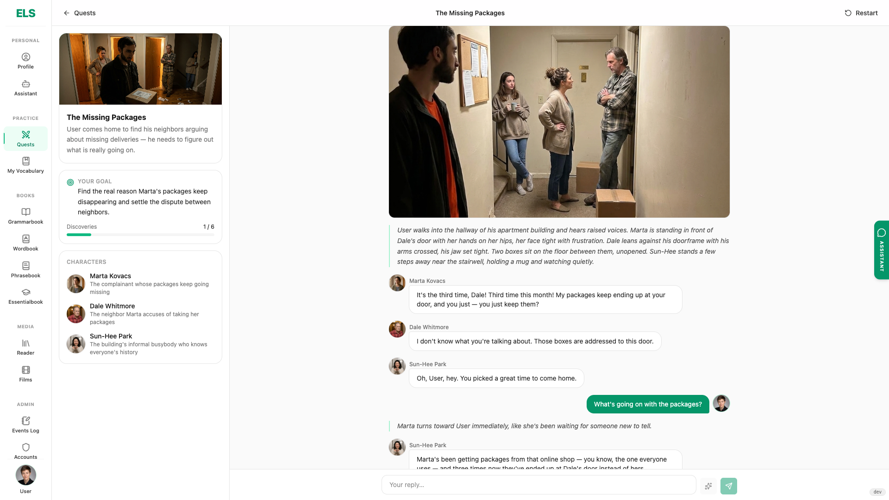
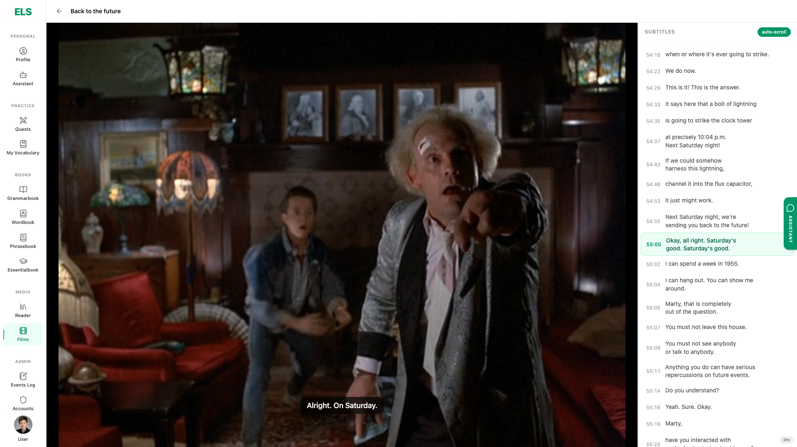

# ELS — English Learning Studio

Practice a language with **films**, **interactive quests**, **vocabulary books**, and an **AI assistant** that can read your current lesson or scene.

Built around English by default, but the same studio can be adapted to any language.

## Screenshots

### Interactive quest


### Film + on-screen subtitles


### Grammar unit (theory, pictures, matching & highlighting)


### Assistant grounded in the open film scene


## Quick start

```bash
# backend
cd backend && cp .env.example .env && make up

# frontend (other terminal)
cd frontend && pnpm install && pnpm --filter @els/main-app dev
```

Open http://localhost:5173 — default admin is in `backend/.env.example` (`BOOTSTRAP_ADMIN_*`).
