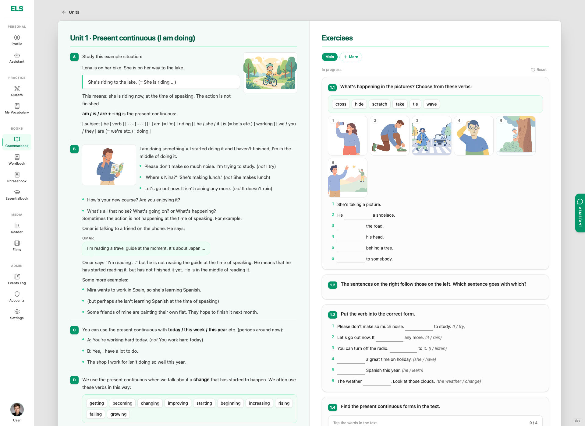
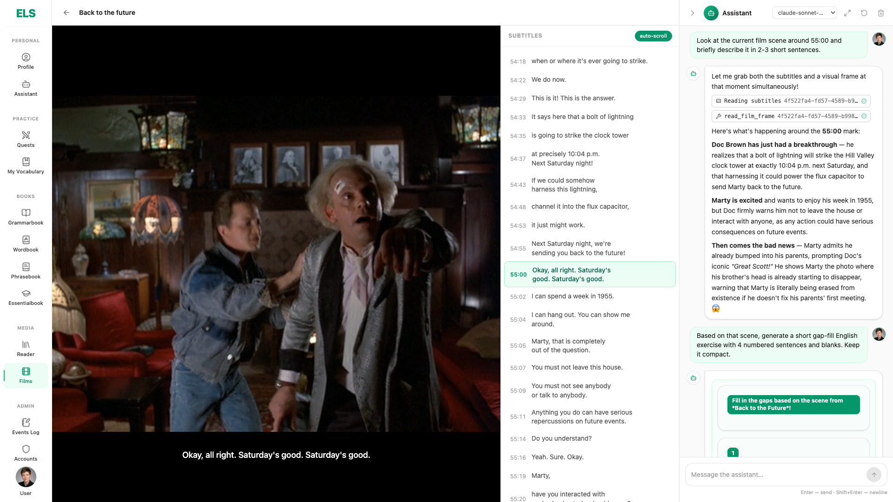

# ELS — English Learning Studio

A self-hosted studio for learning a language the fun way: watch films, play story quests, read books — and everything you tap gets explained, saved and drilled later. English by default, adaptable to any language.

## What's inside

- **Films** — watch with subtitles, tap any word or phrase to look it up and save it.
- **Quests** — describe any real-life situation and play it out in dialogue: a job interview, a date, checking in at a hotel. Generated for your level, with scene art.
- **Books** — grammar, vocabulary, phrasal verbs and essential words. Units are generated like real textbook chapters: theory, exercises, pictures.
- **Reader** — bring your own books, same tap-to-lookup everywhere.
- **Workout** — a daily lesson assembled from your recent mistakes: a film scene, reading, writing, grammar, dictation, speaking.
- **Skill practice** — separate reading, listening, writing and speaking rooms on any topic you like.
- **Analyze** — paste any text and get its words, phrasal verbs and grammar broken down.
- **Vocabulary** — everything you saved comes back as spaced-repetition training.
- **Assistant** — a chat that sees the scene or lesson you have open right now.

## In action

### Quest


### Analyze


### Grammar unit


### Assistant grounded in the open film scene


## Quick start

```bash
# backend
cd backend && cp .env.example .env && make up

# frontend (other terminal)
cd frontend && pnpm install && pnpm --filter @els/main-app dev
```

Open http://localhost:5173 — default admin is in `backend/.env.example` (`BOOTSTRAP_ADMIN_*`).

## Try it live

There is a running test instance. Want access to play with it? Drop a line to sunkencityr.yeh@gmail.com.
